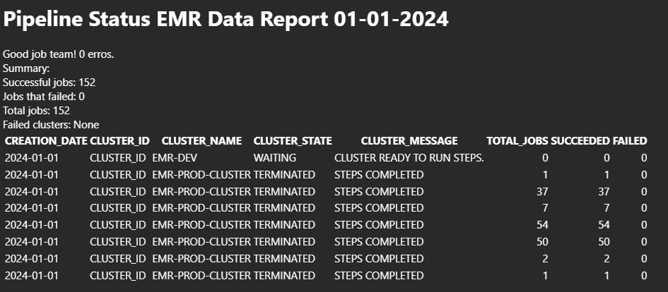

## AWS EMR Workflow Monitor
Efficiently monitor your team's daily workflows on Amazon EMR with this script designed to simplify the process. The concept is straightforward: access cluster logs and steps to gather essential information, then effortlessly dispatch them using your organizational email on a daily basis. To ensure seamless execution, make sure you have an organizational email and a corresponding .csv with its credentials securely stored in your S3 bucket.
While CloudWatch Events and AWS SNS offer alternative approaches, this script was crafted from the ground up, providing a hands-on solution for those who prefer building everything from scratch. Feel free to integrate it into your workflow, and don't hesitate to contribute or share your insights to make it even better. Your feedback is appreciated!

#### Email output example
